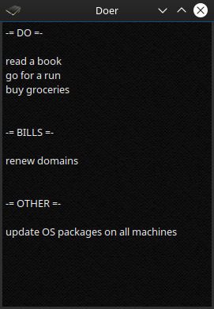

# Doer

This notepad application is so lightweight it saves and reads text to and from just one file.  
With almost no user interface, it works great as a place to keep your notes in.

It was built to replace a giant collection of small paper notes scattered all over my workspace and home.  
Comes in handy as a to-do list. Can also help you keep those pretty Japanese smileys at hand.

## Customize

Placing a file named `doer.qss` into `~/.config/doer/` will serve as a custom stylesheet for the program.  
Use [doer.qss](res/stylesheets/doer.qss) as a reference.

## Control

    Ctrl+Q:       Exit the program
    Ctrl+F / F11: Toggle fullscreen
    Esc:          Exit fullscreen / hide to tray

## Build

    qmake
    make -j

## Install

    sudo make install

## Uninstall

    sudo make uninstall

## License

This is free and unencumbered software released into the public domain.
